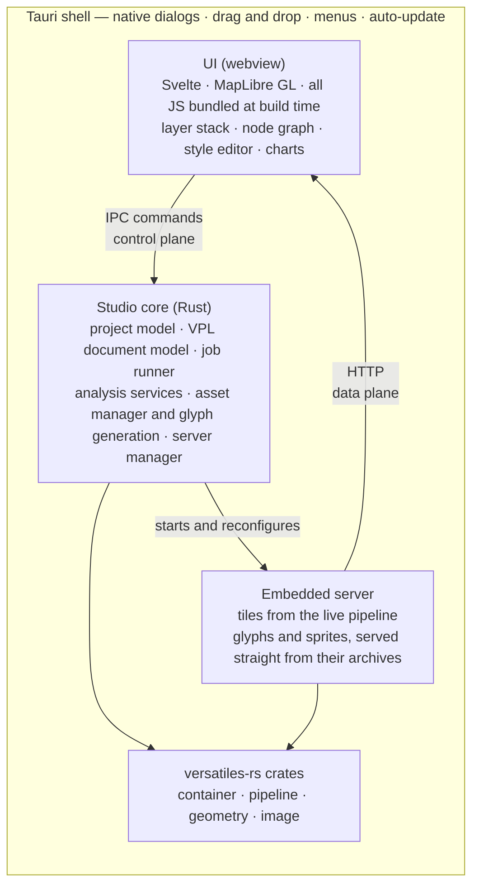

# Architecture

> Draft. The shell question and the internal boundaries are settled ([Q1](decisions.md),
> [Q3](decisions.md), [Q4](decisions.md), [Q6](decisions.md), [Q11](decisions.md)). The panel layout
> is not.

## The central idea

The load-bearing decision is the **embedded server**. Rather than pushing tile bytes through IPC,
Studio runs `versatiles serve` on loopback against the _current_ pipeline state and lets MapLibre
fetch over HTTP as it normally would. That makes live preview (C3) nearly free — change a parameter,
invalidate the source, MapLibre re-fetches, with no separate build step — keeps MapLibre completely
standard, lets `@versatiles/svelte` and `maplibre-versatiles-styler` drop in unmodified, and serves
glyphs and sprites straight out of their `.tar.br` archives via `serve -s` ([Q9](decisions.md)).

Costs to watch: cache invalidation on every pipeline edit, and binding a free loopback port without
tripping firewall prompts.

## Three planes

Settled by [Q3](decisions.md). The UI reaches the core three ways, chosen by what is being moved.

| Plane       | Carries                                                       | Mechanism                            |
| ----------- | ------------------------------------------------------------- | ------------------------------------ |
| **Control** | open a container, read metadata, list operations, start a job | Tauri IPC commands, typed end to end |
| **Data**    | tiles, glyphs, sprites                                        | the embedded HTTP server             |
| **Events**  | job progress, warnings, log lines                             | Tauri Channels                       |

The split is forced, not stylistic: Tauri serialises command returns as JSON and warns this is slow
for large payloads, so tile bytes must not travel over IPC. For a one-off blob — a raw tile for A4 —
`tauri::ipc::Response` returns an array buffer without JSON.

## Layers

**Tauri shell.** Native window, menus, file dialogs, drag & drop, file type associations,
auto-update. Deliberately thin — the bridge to the platform, no application logic.

**UI (web).** Svelte, matching the rest of the org, with MapLibre GL for the canvas. All JavaScript
is bundled at build time; **no Node runtime ships** ([Q5](decisions.md)).

**Studio core (Rust).** The part worth designing carefully:

- _Project model_ — sources, pipeline, style, views; a directory with a `project.yaml` manifest
  beside real `.vpl` and `style.json` files (G1, [Q6](decisions.md))
- _VPL document model_ — a lossless syntax tree over the pipeline text, keeping spans, comments and
  parameter order, so the node graph (C1) and inline errors (C4) address the real file
  ([Q11](decisions.md))
- _Job runner_ — long operations with progress, cancellation and logging (E7); must exist before any
  export feature, not after
- _Analysis services_ — probe-derived statistics, cached in memory per container
  ([Q4](decisions.md)), aggregating over `layer_stats()` and `validate_tile()`
- _Asset manager_ — download, pin, verify and remove font families and sprite sets (G7), and
  generate glyph sets from the user's own fonts (D9)
- _Server manager_ — lifecycle of the embedded server, one instance per previewed pipeline node

The core is a plain Rust library with no Tauri types, so it can be driven by ordinary Rust tests;
`#[tauri::command]` functions are a thin binding over it. `versatiles_node` proves the shape — the
same idea with napi instead of IPC.

**versatiles-rs.** A library dependency, not shelled out to. Studio should be a first-class consumer
of the crates, and pressure to improve their APIs is a welcome side effect.

## Principles

**The text is the source of truth.** The VPL text, the style JSON and the project file are the real
artefacts; the node graph, style panels and layer tree are views onto them. This is what makes
projects diffable, reviewable and handable to a CLI user.

Taken seriously it has teeth: a view that edits the text must edit it **surgically**, never
reformatting, reordering parameters or dropping comments as a side effect. That is why the node
graph needs a lossless syntax tree rather than a parse-and-print round trip ([Q11](decisions.md)).

**Generate UI from metadata where possible.** Parameter forms come from `field_meta`
([inventory](ecosystem.md)). Hand-written UI per operation would rot the first time versatiles-rs
adds an operation.

**Every action names its command.** G2 is an architectural constraint, not a feature: if an action
cannot be expressed as a command, it probably should not exist.

**Nothing only exists inside Studio.** Every artefact must be exportable in a documented format.

**Assets are archives, not file trees.** Fonts and sprites stay compressed and are served from
there — atomic to verify, replace and delete. Glyph sets Studio generates itself (D9) are written as
archives too, so downloaded and generated fonts take the same path.

## Settled questions

| Question | Answer                                                                                   |
| -------- | ---------------------------------------------------------------------------------------- |
| **Q1**   | Native Tauri application, not a subcommand serving a browser UI                          |
| **Q3**   | Three planes — IPC for control, HTTP for data, Channels for events                       |
| **Q4**   | Analysis statistics in memory, keyed by container; no sidecars, none in the project file |
| **Q5**   | No Node runtime ships; all JavaScript is bundled into the webview at build time          |
| **Q6**   | A project is a directory of real files described by a YAML manifest                      |
| **Q11**  | The node graph is in release 1, and needs a lossless VPL syntax tree                     |

See the [decision log](decisions.md) for the reasoning.
