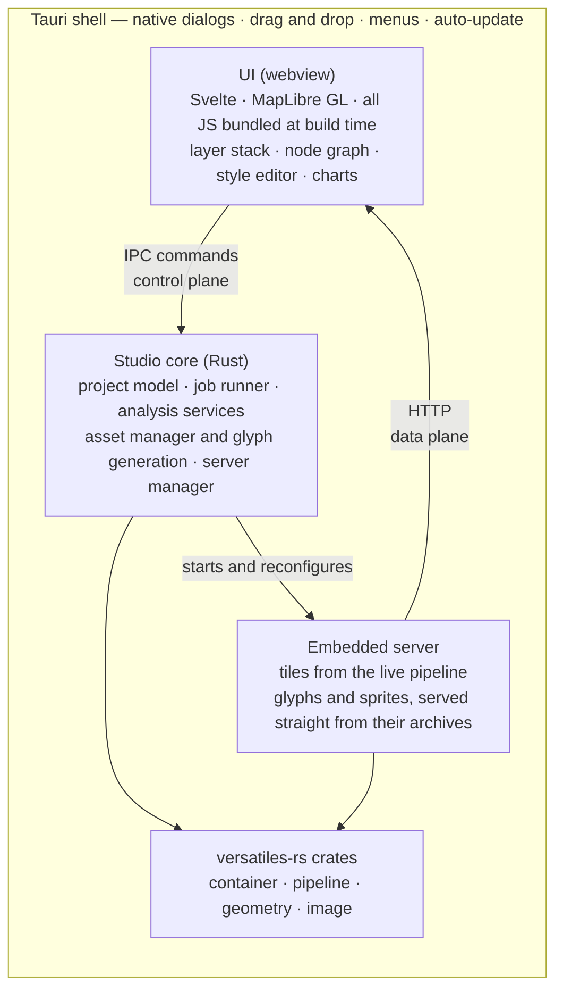

# Architecture

> Draft. The shell question is settled ([Q1](decisions.md)); the internal boundaries are not.

## The central idea

The load-bearing decision is the **embedded server**. Instead of pushing tile bytes through IPC
into the webview, Studio runs `versatiles serve` on localhost against the _current_ pipeline state
and lets MapLibre fetch tiles over HTTP as it normally would.

This buys a great deal:

- Live preview (C3) becomes almost free: change a pipeline parameter, invalidate the source,
  MapLibre re-fetches. There is no separate "build" step to design.
- MapLibre stays completely standard — no custom protocol handler, no bespoke tile plumbing.
- Existing pieces (`@versatiles/svelte`, `maplibre-versatiles-styler`) drop in unmodified, because
  they already expect an HTTP tile source.
- The same server handles **glyphs and sprites straight out of their `.tar.br` archives** via
  `serve -s`, so map assets need no unpacking and no second mechanism. See [Q9](decisions.md).

Cost to watch: cache invalidation on every pipeline edit, and binding to a free port on loopback
only, without tripping firewall prompts.

## Three planes

Settled by [Q3](decisions.md). The UI reaches the core three different ways, chosen by what is
being moved.

| Plane       | Carries                                                                          | Mechanism                            |
| ----------- | -------------------------------------------------------------------------------- | ------------------------------------ |
| **Control** | open a container, read metadata, list VPL operations, start a job, manage assets | Tauri IPC commands, typed end to end |
| **Data**    | tiles, glyphs, sprites                                                           | the embedded HTTP server             |
| **Events**  | job progress, warnings, log lines                                                | Tauri Channels                       |

The split is not stylistic. Tauri serialises command return values as JSON and its own
documentation warns this is slow for large payloads, which is precisely why tile bytes must not
travel over IPC. Where a one-off binary blob is genuinely wanted — a raw tile for the MVT inspector
(A4) — `tauri::ipc::Response` returns an array buffer without JSON, so we do not need an HTTP route
for every such case.

## Layers

**Tauri shell.** Native window, menus, file dialogs, drag & drop, file type associations,
auto-update. Deliberately thin: it should contain no application logic, only the bridge to the
platform.

**UI (web).** Svelte, matching the rest of the org. MapLibre GL for the map canvas. **All
JavaScript is bundled at build time and runs in the webview — no Node runtime ships with the app**
([Q5](decisions.md)). Consumes the core through typed commands and tiles over HTTP.

**Studio core (Rust).** The part worth designing carefully:

- _Project model_ — sources, pipeline, style, views; serialised to the project file (G1)
- _Job runner_ — long operations with progress, cancellation and logging (E7); this must exist
  before any export feature, not after
- _Analysis services_ — the probe-derived statistics behind cluster B, cached per container
- _Asset manager_ — download, pin, verify and remove font families and sprite sets (G7), and
  generate glyph sets from the user's own fonts via `versatiles-glyphs-rs` (D9)
- _Server manager_ — lifecycle of the embedded server, one instance per previewed pipeline node

The core is a plain Rust library with no Tauri types in it. The `#[tauri::command]` functions are a
thin binding over it, so the core can be driven by ordinary Rust tests with no Tauri runtime.
`versatiles_node` is the proof that this shape works — it is the same idea with napi instead of
IPC — and a useful reference for naming and granularity.

**versatiles-rs.** Consumed as a library dependency, not shelled out to. Studio should be a
first-class consumer of the crates, and pressure to improve their APIs is a welcome side effect.

## Principles

**The text is the source of truth.** The VPL text, the style JSON and the project file are the
real artefacts; the node graph, the style panels and the layer tree are views onto them. This is
what makes projects diffable, reviewable, git-friendly and handable to a CLI user. It also removes
a whole class of "the GUI and the file disagree" bugs.

**Generate UI from metadata where possible.** Parameter forms come from `field_meta`
([see inventory](ecosystem.md)). Hand-written UI per operation would rot the first time
versatiles-rs adds an operation.

**Every action names its command.** G2 is an architectural constraint, not a feature: if an action
cannot be expressed as a command, it probably should not exist.

**Nothing only exists inside Studio.** Every artefact must be exportable in a documented format.

**Assets are archives, not file trees.** Fonts and sprites stay in the compressed archives they
were downloaded as, and are served from there. Atomic to verify, replace and delete. Glyph sets
Studio generates itself (D9) are written as archives too, so downloaded and generated fonts take
the same path through the manifest, the asset manager and the server.

## Open architectural questions

Detailed in [Open Decisions](decisions.md); summarised here.

**Q4 — where analysis statistics live.** In-memory cache, sidecar file next to the container, or
in the project file. Decides whether cluster B feels instant or sluggish.

**Q6 — project file format**, and whether it embeds or references the pipeline and style.
