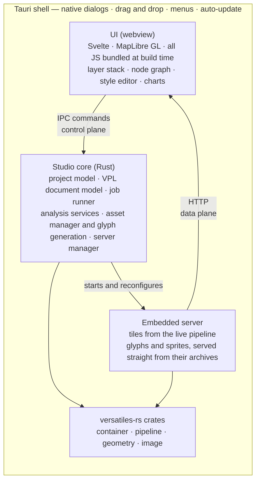

# Architecture

> Draft. The shell question and the internal boundaries are settled ([Q1](decisions.md),
> [Q3](decisions.md), [Q4](decisions.md), [Q6](decisions.md), [Q11](decisions.md)). The panel layout
> is not.

## The central idea



The load-bearing decision is the **embedded server**. Rather than pushing tile bytes through IPC,
Studio runs `versatiles serve` on loopback against the _current_ pipeline state and lets MapLibre
fetch over HTTP as it normally would. That makes live preview (C3) nearly free — change a parameter,
invalidate the source, MapLibre re-fetches, with no separate build step — keeps MapLibre completely
standard, lets `@versatiles/svelte` and `maplibre-versatiles-styler` drop in unmodified, and serves
glyphs and sprites straight out of their `.tar.gz` archives via `serve -s` ([Q9](decisions.md)).

Costs to watch: cache invalidation on every pipeline edit, and binding a free loopback port without
tripping firewall prompts.

## Three planes

Settled by [Q3](decisions.md). The UI reaches the core three ways, chosen by what is being moved.

| Plane       | Carries                                                       | Mechanism                            |
| ----------- | ------------------------------------------------------------- | ------------------------------------ |
| **Control** | open a container, read metadata, list operations, start a job | Tauri IPC commands, typed end to end |
| **Data**    | tiles, glyphs, sprites                                        | the embedded HTTP server             |
| **Events**  | job progress, warnings, log lines                             | Tauri Channels                       |

The split is forced, not stylistic — [Q3](decisions.md#q3--three-planes-ipc-for-control-http-for-data-channels-for-events) has the reasoning. The consequence
to remember here is that tile bytes must never travel over IPC, and that a one-off blob is the
exception: `tauri::ipc::Response` returns an array buffer without JSON, which is how A4 reads a raw
tile.

## Layers

**Tauri shell.** Native windows, menus, file dialogs, drag & drop, file type associations,
auto-update. Deliberately thin — the bridge to the platform, no application logic. **One window per
project, one application instance** ([Q16](decisions.md)): each webview is its own OS process, so a
project gets both crash isolation and its own WebGL context budget.

**UI (web).** Svelte 5, matching the rest of the org, with MapLibre GL for the canvas. All
JavaScript is bundled at build time; **no Node runtime ships** ([Q5](decisions.md)). Components are
written from scratch rather than imported from `@versatiles/svelte` ([Q18](decisions.md)) — see the
[component inventory](components.md).

**Studio core (Rust).** The part worth designing carefully:

- _Project model_ — sources, pipeline, style, views; a directory with a `project.yaml` manifest
  beside real `.vpl` and `style.json` files (G1, [Q6](decisions.md))
- _App store_ — recent sources, view bookmarks (A7), and the window's own layout: pane widths, which
  panes are open, the background choice and the map camera. Application state, not project state, so
  it lives beside the app's data, split across JSON files **by recovery policy** rather than by
  subject ([Q21](decisions.md)) — precious data is never silently replaced with an empty one. The
  core owns them; the platform layer decides where they live
- _VPL document model_ — a lossless syntax tree over the pipeline text, keeping spans, comments and
  parameter order, so the node graph (C1) and inline errors (C4) address the real file
  ([Q11](decisions.md)). A project holds **several named graphs**, each one document producing one
  named tile source ([Q32](decisions.md)); undo spans all of them, because ⌘Z should undo the last
  edit rather than the last edit _here_ (G6)
- _Job runner_ — long operations with progress, cancellation and logging (E7); must exist before any
  export feature, not after
- _Analysis services_ — probe-derived statistics, cached in memory per container
  ([Q4](decisions.md)), aggregating over `layer_stats()` and `validate_tile()`
- _Asset manager_ — download, pin, verify and remove font families and sprite sets (G7), and
  generate glyph sets from the user's own fonts (D9)
- _Server manager_ — lifecycle of the **single** embedded server. `add_tile_source` and
  `remove_tile_source` work on a running server, so **each graph is a named mount**, not a server of
  its own ([Q16](decisions.md)). Every graph is served so the style can name it; one node may be
  _pinned_ on top of that for preview ([Q32](decisions.md))

The core is a plain Rust library with no Tauri types, so it can be driven by ordinary Rust tests;
`#[tauri::command]` functions are a thin binding over it. `versatiles_node` proves the shape — the
same idea with napi instead of IPC.

**versatiles-rs.** A library dependency, not shelled out to. Studio should be a first-class consumer
of the crates, and pressure to improve their APIs is a welcome side effect.

## Repository layout

```text
versatiles-studio/
├── Cargo.toml                  workspace: crates/* + src-tauri
├── package.json                Vite · Svelte 5 · TypeScript — build-time only (Q5)
├── index.html                  single entry; one surface, no routes         (Q22)
│
├── crates/
│   └── studio-core/
│       └── src/
│           ├── vpl/            document model; several named graphs      (Q11, Q32)
│           ├── project.rs      project.yaml, load/save, Save As, zip     (G1, Q6)
│           ├── graphs.rs       the set of graphs a project holds         (Q32)
│           ├── history.rs      one undo stack across all of them         (G6)
│           ├── jobs.rs         runner, progress, cancellation, log       (E7)
│           ├── preview.rs      running a graph so the map can show it    (C3)
│           ├── export.rs       writing the result to a container         (F2)
│           ├── import.rs       the catalogue of ways in                  (E1–E3)
│           ├── tabular.rs      a delimited file's header                 (E2)
│           ├── suggest.rs      values a field could take                 (E2)
│           ├── analysis.rs     probe stats, in-memory per container      (Q4)
│           ├── assets.rs       install, pin, verify; glyph generation    (G7, D9)
│           ├── store.rs        recents and bookmarks, outliving a window (A7, Q21)
│           └── server.rs       embedded server lifecycle, named mounts   (Q16)
│
├── src-tauri/                  deliberately thin
│   ├── tauri.conf.json
│   ├── capabilities/
│   ├── icons/                  generated from app-icon.png
│   ├── resources/              bundled tier, shipped as archives         (Q9)
│   │   ├── sprites.tar.gz
│   │   └── glyphs.tar.gz
│   └── src/
│       ├── main.rs             the entry point
│       ├── commands/           #[tauri::command] bindings — control plane
│       ├── events/             Channels — event plane                    (Q3)
│       ├── windows.rs          one window per project                    (Q16)
│       ├── opened.rs           files the OS asks Studio to open          (S0.1)
│       ├── assets.rs           locating the bundled tier                 (S0.6)
│       ├── bindings.rs         generating bindings.ts from the commands  (S0.3)
│       └── state.rs            state owned by the Tauri process
│
├── public/
│   └── maplibre-gl-worker.js   generated, not hand-written               (Q18)
│
├── src/                        the webview
│   ├── main.ts                 mounts the app; imports both stylesheets
│   ├── App.svelte
│   └── lib/
│       ├── shell/              the frame: AppShell · Sidebar · Pane · bars
│       ├── panes/<pane>/       each pane and its own parts               (Q31)
│       ├── map/                the map's components and its helpers
│       ├── common/             used by more than one owner
│       ├── ipc/                bindings.ts (generated) + typed wrappers
│       ├── state/              view state, and mirrors of core state     (Q16)
│       ├── styles/             tokens, base, and reading tokens from JS
│       └── vpl/                parsing and highlighting, for the editor
│
├── scripts/                    build-time tooling, not shipped
│   ├── bundle_worker.ts        MapLibre 6 worker fix                     (S1.4)
│   └── fetch-assets.ts         · update-assets.ts — the pinned tier      (S0.6, S0.12)
├── .github/workflows/          CI for Linux and macOS                    (S0.7)
└── docs/
```

Which component lives in which of those folders, and why, is
[Svelte Components](components.md).

**`studio-core` is a separate crate because [Q3](decisions.md) requires it.** Inside `src-tauri` the
"no Tauri types" rule would be a convention nobody enforces; as a workspace member it is a compile
error. `src-tauri/src` therefore holds two of the three planes and nothing that could live below
them — the third plane is HTTP and needs no code there, since the server lives in the core. What is
left beside `commands/` and `events/` is what genuinely belongs to the platform: windows, the files
the OS hands over, where the bundled assets are, and the generator that writes `bindings.ts`.

**`resources/` holds archives, not directories.** [Q9](decisions.md) is emphatic that assets are
never unpacked, and a `resources/sprites/` tree would quietly undo that at build time.

**No `src/routes`.** Studio navigates by mode, not by URL, and has no server or SSR, so SvelteKit's
value is unused while its cost — an adapter config and a router for a single-page app — is not.

**No `crates/studio-vpl`.** The lossless syntax tree should land upstream in `versatiles_pipeline`
([Q11](decisions.md)). If that crate ever appears here, it means upstream declined — a signal worth
noticing rather than a neutral fact.

**`ipc/bindings.ts` is committed, not generated at build time.** `tauri-specta` can do either;
committing it makes a change to the command surface visible in review, which is the drift
[Q3](decisions.md) exists to prevent. The cost is staleness, caught by a plain `cargo test` —
`bindings_are_up_to_date` regenerates into a scratch file and compares, and says how to fix itself
(`UPDATE_BINDINGS=1`). A test rather than a build step, so a broken pre-1.0 generator cannot stop the
app from building; and it is `.prettierignore`d, because reformatting a generated file is what makes
that test fail for no reason.

## Principles

**The text is the source of truth.** The VPL text, the style JSON and the project file are the real
artefacts; the node graph, style panels and layer tree are views onto them. This is what makes
projects diffable, reviewable and handable to a CLI user.

Taken seriously it has teeth: a view that edits the text must edit it **surgically**, never
reformatting, reordering parameters or dropping comments as a side effect. That is why the node
graph needs a lossless syntax tree rather than a parse-and-print round trip ([Q11](decisions.md)).

**Nothing durable lives only in the webview.** The core holds the project, pipeline, jobs and
server; the webview renders them. The map camera, the selected node, the open graphs and the pane
layout are all restorable from the core, so a reloaded window loses nothing ([Q16](decisions.md));
the active mode joins them when the mode bar arrives at S4.1. Scroll position deliberately does not
— it is cheap to lose, and carrying it would mean the core modelling scroll containers it has no
other reason to know about. This is the source-of-truth principle applied to volatile UI state
rather than to files.

**Generate UI from metadata where possible.** Parameter forms come from `field_meta`
([inventory](ecosystem.md)). Hand-written UI per operation would rot the first time versatiles-rs
adds an operation.

**Nothing only exists inside Studio.** Every artefact must be exportable in a documented format.

**The two platforms deliver an opened file differently.** macOS sends `RunEvent::Opened`, possibly
before the window exists and possibly again later; Linux puts the path in `argv`, once. `opened.rs`
funnels both into a queue the webview drains, rather than each caller learning the difference.

**Tile URLs carry a revision.** The embedded server sends `cache-control: public, max-age=2419200`
— 28 days, hardcoded in `versatiles`' handler with no way to turn it off. That is right for a public
tile server and wrong for an editing surface: mount names are stable by design, so a rebuilt preview
or a re-opened file asks for the same URL and the webview answers from its cache with tiles that may
be weeks old. `ServerManager::tile_url` appends a per-mount counter, so every build is a URL no cache
has seen. The reader itself is not the problem — the runtime re-reads the file on every open.

**Assets are archives, not file trees.** Fonts and sprites stay compressed and are served from
there — atomic to verify, replace and delete. Glyph sets Studio generates itself (D9) are written as
archives too, so downloaded and generated fonts take the same path.

## Settled questions

| Question | Answer                                                                                   |
| -------- | ---------------------------------------------------------------------------------------- |
| **Q1**   | Native Tauri application, not a subcommand serving a browser UI                          |
| **Q3**   | Three planes — IPC for control, HTTP for data, Channels for events                       |
| **Q4**   | Analysis statistics in memory, keyed by container; no sidecars, none in the project file |
| **Q5**   | No Node runtime ships; all JavaScript is bundled into the webview at build time          |
| **Q6**   | A project is a directory of real files described by a YAML manifest                      |
| **Q11**  | The node graph is in release 1, and needs a lossless VPL syntax tree                     |
| **Q16**  | One application instance, one window per project, one embedded server with named mounts  |

See the [decision log](decisions.md) for the reasoning.
